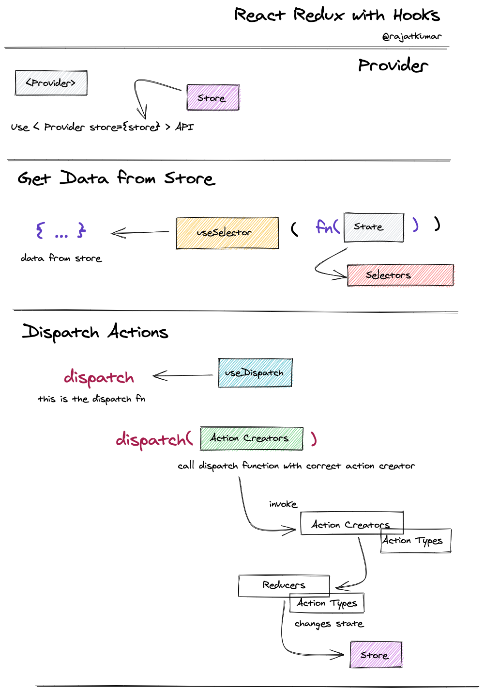
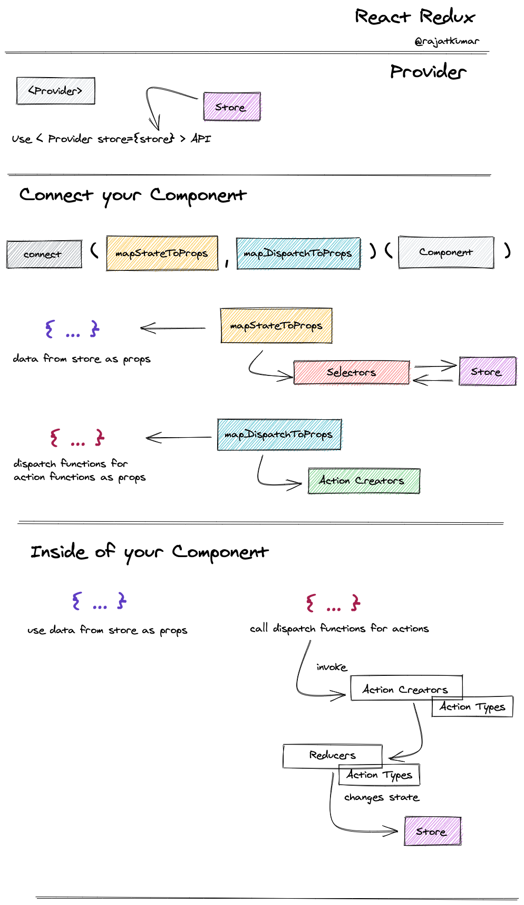

This project was bootstrapped with [Create React App](https://github.com/facebook/create-react-app).

# Simple Todo app with React, Redux and Typescript

The basic goal here is to understand how to work with React, React-Redux and Typescript together.

If you are struggling with how to get the right typings, this app is a good way to start.

## with Hooks and Saga

-   Checkout `saga` branch for the code

## with Hooks

-   Checkout `with-hooks` branch for the code

### Simple Mental Model

## with Connect

-   Checkout `using-classes` branch for the code

### Simple Mental Model

